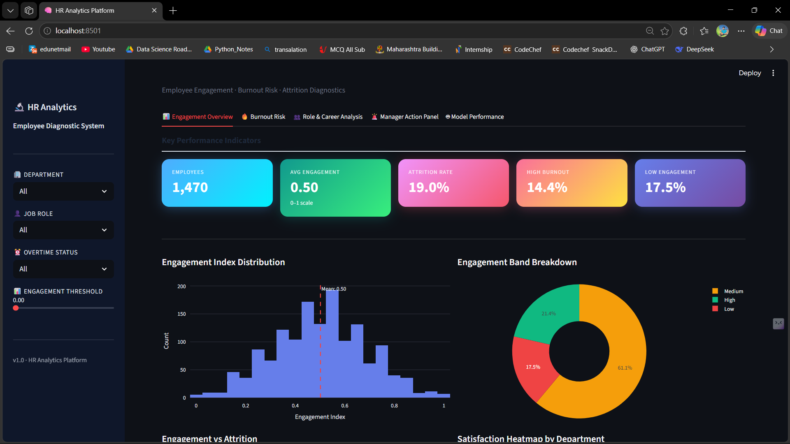
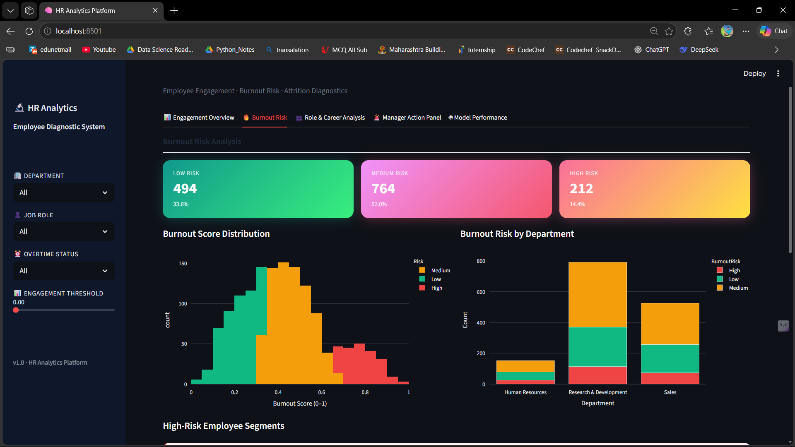

# 📊 HR Analytics – Employee Attrition Prediction System

## 📌 Problem Statement

Employee attrition is a critical challenge for organizations, leading to increased hiring costs, productivity loss, and operational inefficiencies.
This project focuses on predicting employee attrition and identifying key factors influencing employee turnover, enabling HR teams to take proactive, data-driven decisions.

---

## 🎯 Objective

* Predict whether an employee is likely to leave the organization
* Identify key drivers influencing attrition
* Provide actionable insights for HR decision-making

---

## 📂 Dataset

The dataset contains employee-related features such as:

* Age, Salary, Job Role
* Overtime, Job Satisfaction
* Work Environment, Experience

---

## ⚙️ Tech Stack

* **Language:** Python
* **Libraries:** Pandas, NumPy, Scikit-learn, XGBoost
* **Visualization:** Matplotlib, Seaborn
* **App Framework:** Streamlit
* **Deployment:** Docker

---

## 🔍 Exploratory Data Analysis (EDA)

Key observations:

* Employees working overtime show significantly higher attrition rates
* Low job satisfaction strongly correlates with employee churn
* Salary and work-life balance are major influencing factors

---

## 🤖 Machine Learning Models

* Logistic Regression
* Random Forest
* XGBoost (**Best Performing Model**)

---

## 📈 Model Performance

| Model               | Accuracy |
| ------------------- | -------- |
| Logistic Regression | 60.2%    |
| Random Forest       | 78.57%   |
| XGBoost             | 80.95%   |

---

## 📊 Key Business Insights

* 🔴 Overtime significantly increases attrition risk
* 🔴 Low salary is a major contributor to employee turnover
* 🟢 High job satisfaction reduces attrition probability
* 🟢 Work-life balance is a critical retention factor

---

## 💡 Business Impact

This solution enables HR teams to:

* Identify high-risk employees early
* Reduce employee turnover
* Improve retention strategies
* Make data-driven workforce decisions

---

## 🖥️ Application (Streamlit Dashboard)

Features:

* Real-time employee attrition prediction
* Interactive dashboard with HR insights
* User-friendly interface for decision-making

---

## 🎥 Project Demo (Screen Recording)

👉 [Watch Demo Video](https://drive.google.com/file/d/1xAyLOt-7FJoZmT5TwYUPVHta41Kc9lAj/view?usp=sharing)

---

### 🔹 Engagement Overview


💡 Insight: Employees with lower engagement scores show higher attrition probability.

### 🔹 Burnout Risk


💡 Insight: High burnout scores are strongly linked with high attrition probability.
---

## 🚀 How to Run Locally

```bash
git clone https://github.com/Saurabhchatur1/hr-analytics-attrition-prediction.git
cd hr-analytics-project
pip install -r requirements.txt
streamlit run app.py
```

---


---

## 📁 Project Structure

```
├── src/
├── models/
├── notebooks/
├── app/
├── config/
├── Dockerfile
├── requirements.txt
```

---

## 🔮 Future Improvements

* Deploy on cloud platforms (Streamlit Cloud / AWS / Render)
* Add real-time data pipeline
* Enhance model performance using advanced ML techniques

---

## 👨‍💻 Author

**Saurabh Chatur**

B.Tech Data Science

Aspiring Data Analyst / Data Scientist
